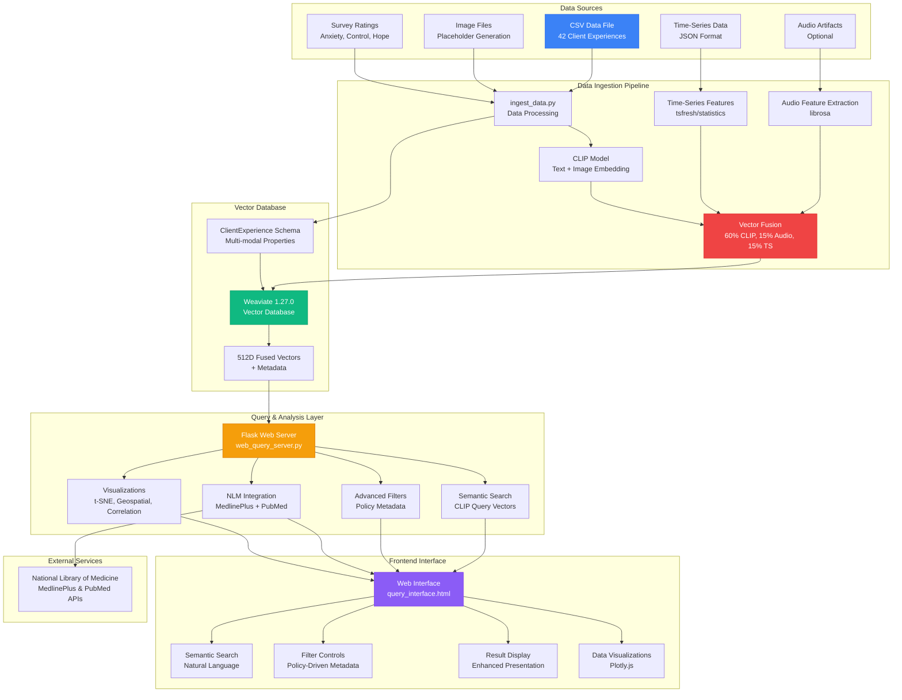
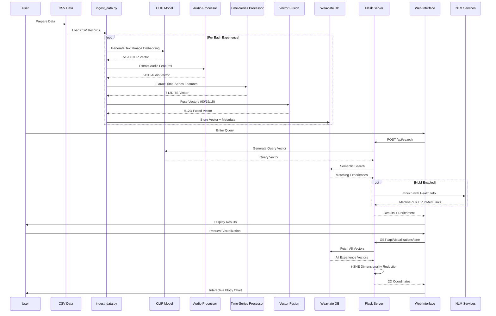
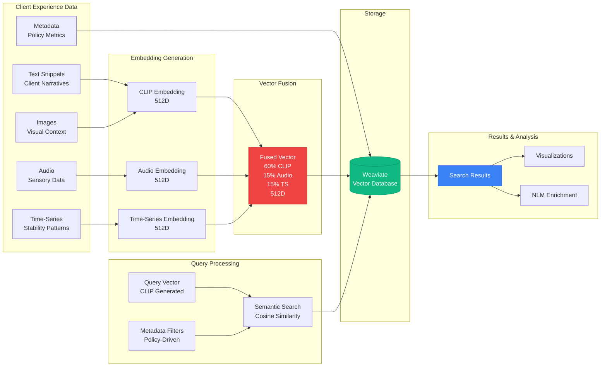
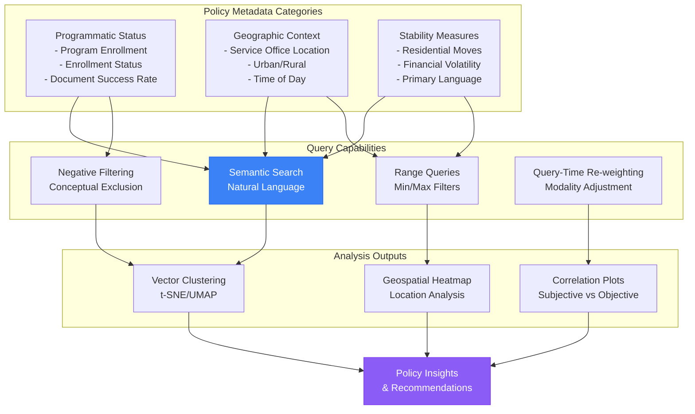
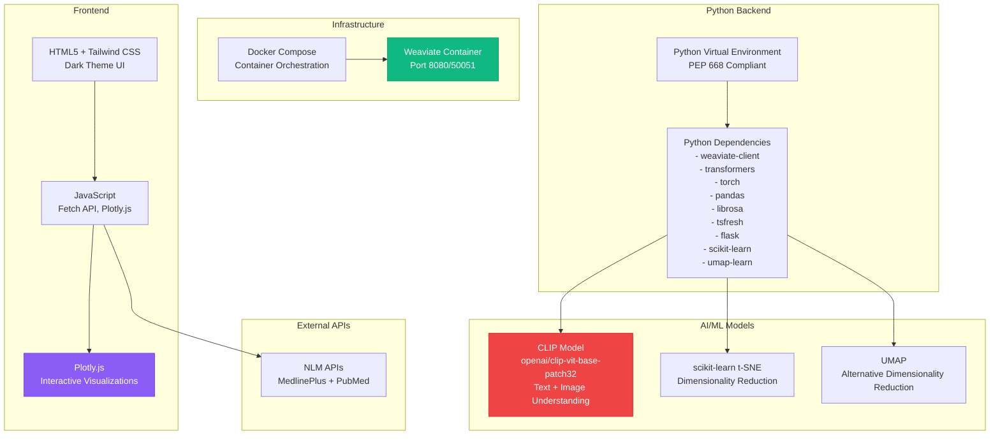
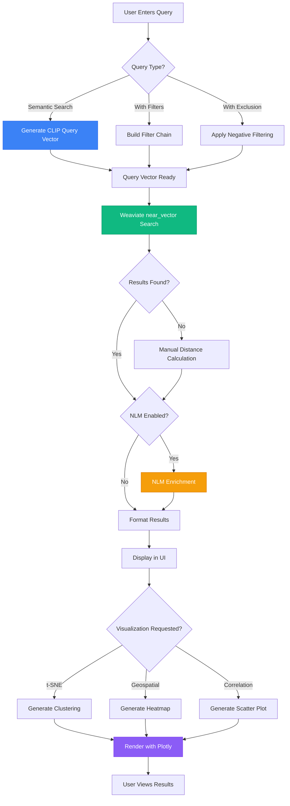

# Social Services Experience Analytics Platform - Architecture Diagram

## System Architecture Overview

## Detailed Data Flow Diagram

## Component Interaction Diagram

## Policy-Driven Metadata Flow

## Technology Stack Diagram

## Query Processing Flow

